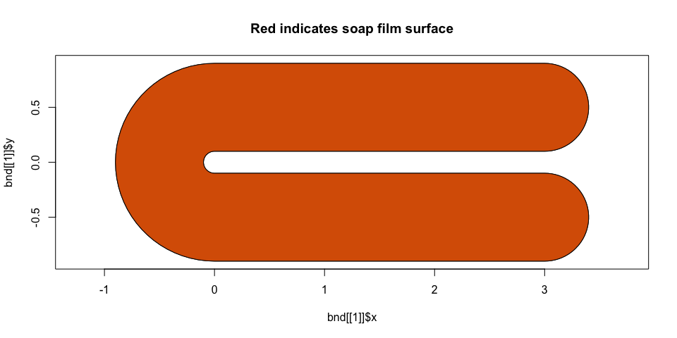
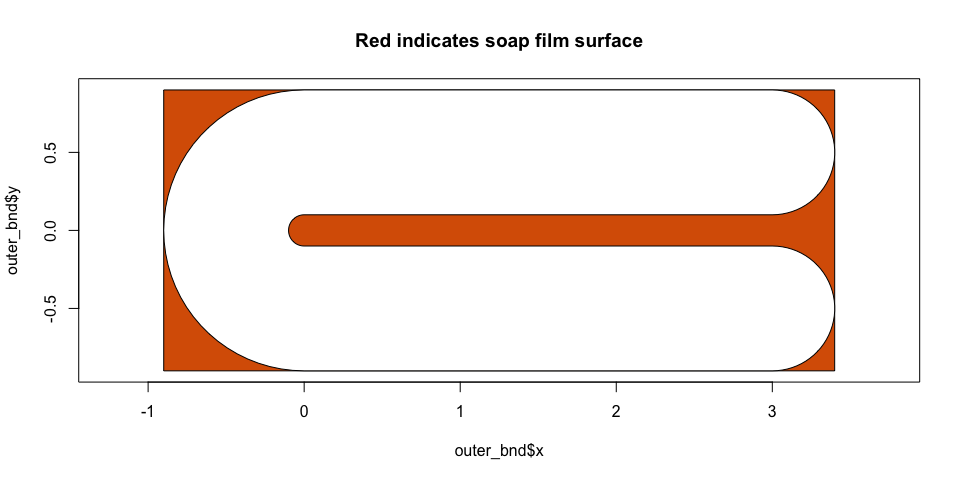

# Check whether a soap film smoother boundary and knots make sense

Setting up a soap film smoother is often a hard and frustrating process.
This function checks that the data that you feed to soap are “correct”.
Feed it our boundary and optionally knots and data and the function will
show you what soap will model.

The function also plots the area that will be modelled by the soap film
smoother in red.

To do all the spatial stuff, we require a couple of extra libraries:
`rgeos` and `sp` (as well as `mgcv`).

## Examples

### Simple example with the “Ramsay horseshoe”

``` r
source("soap_check.R")
fsb <- list(fs.boundary())
soap_check(fsb)
```

<!-- -->

    ## [1] TRUE

### “inside-out” "Ramsay horseshoe

``` r
source("soap_check.R")
fsb <- fs.boundary()
fsb <- list(fsb,
            list(x=range(fsb$x)[c(1,1,2,2,1)],
                 y=range(fsb$y)[c(1,2,2,1,1)]))
soap_check(fsb)
```

<!-- -->

    ## [1] TRUE

## Other tips

  - The script assumes that your spatial variable names are `x` and `y`.
  - Make sure that your locations are in Northings/Eastings. Using
    latitude and longitude will give strange results (as the soap film
    smoother is isotropic so treats 1 unit change in either dimension is
    equal, this isn’t true for lat/long\!).
  - Sometimes you need to increase the tolerance (e.g `tol=1e-6`)
  - Note that the boundary must be a `list` of `list`s or `data.frame`s.
    So if you have a polygon boundary with your boundary vertices in it,
    that must be wrapped in a `list`\!

Written by David L Miller and released under the GPL (version 2).
